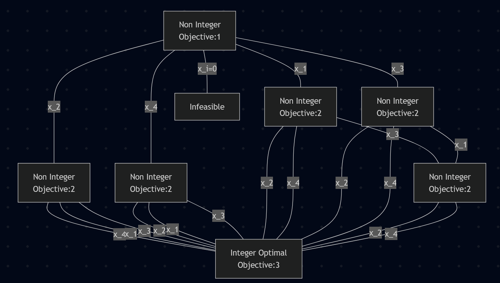

# HW 2
## 1
### e
Our original LP is as follows:

> $\max x_1 + x_2$
>
> s.t. $2x_1 + x_2 \leq 3$
>
>> $0\leq x_1,x_2 \leq 1$

This is equivalent to:

> $\max x_1 + x_2$
>
> s.t. $2x_1 + x_2 \leq 3$
>
>> $x_1 \leq 1$
>>
>> $x_2 \leq 1$
>>
>> $0\leq x_1,x_2$

Thus the dual is:

> $\min 3y_1 + y_2 + y_3$
>
> s.t. $2y_1 + y_2 \geq 1$
>
>> $y_1 + y_3 \geq 1$
>>
>> $y_1,y_2,y_3 \geq 0$


Thus the complementary slackness conditions are as follows:

> $(2x_1+x_2-3)y_1 = 0$
>
> $(x_1-1)y_2 = 0$
>
> $(x_2-1)y_3 = 0$
>
> $(1-2y_1-y_2)x_1 = 0$
>
> $(1-y_1-y_3)x_2 = 0$


### f
```{python}
#| eval: false
from docplex.mp.model import Model

mdl = Model()

y1 = mdl.continuous_var(name='y1', lb=0)
y2 = mdl.continuous_var(name='y2', lb=0)
y3 = mdl.continuous_var(name='y3', lb=0)

mdl.add_constraint(2*y1 + y2 >= 1)
mdl.add_constraint(y1 + x3 >= 1)

mdl.minimize(3*y1 + y2 + y3)

solution = mdl.solve()

print(mdl.export_as_lp_string())

print(solution)
```

This results in a $y^*$ as follows:

$$
y^* =
\begin{pmatrix}
0 \\
1 \\
1
\end{pmatrix}
$$

We can substitute the values of $y^*$ to our slackness conditions:

> $(2x_1+x_2-3)0 = 0$
>
>> $\rightarrow 0=0$
>
> $(x_1-1)1 = 0$
>
>> $\rightarrow x_1 = 1$
>
> $(x_2-1)1 = 0$
>
>> $\rightarrow x_2 = 1$
>
> $(1-0-1)x_1 = 0$
>
>> $\rightarrow 0=0$
>
> $(1-0-1)x_2 = 0$
>
>> $\rightarrow 0=0$

Therefore we end up with $x^*,y^*$ as follows:

$$
y^* =
\begin{pmatrix}
0 \\
1 \\
1
\end{pmatrix}
, x^* =
\begin{pmatrix}
1 \\
1
\end{pmatrix}
$$

We can also see that by strong duality these solutions result in their objective values being $2$ and equal. Thus these solutions are optimal.

## 3
### c
Our original LP is:

> $\min \gamma$
>
> s.t. $3x_1 + x_2 + x_3 + x_4 \leq \gamma$
>
>> $3x_1 + 4x_2 + 2x_3 + 2x_4 \leq 2\gamma$
>>
>> $3x_1 + 4x_2 + 5x_3 + 3x_4 \leq 3\gamma$
>>
>> $3x_1 + 4x_2 + 5x_3 + 6x_4 \leq 3\gamma$
>>
>> $x_1 + x_2 + x_3 + x_4 = 1$
>>
>> $x_1,x_2,x_3,x_4\geq 0$

Which can be rewritten as:

> $\max 0+0+0+0-\gamma$
>
> s.t. $3x_1 + x_2 + x_3 + x_4 - \gamma \leq 0$
>
>> $3x_1 + 4x_2 + 2x_3 + 2x_4 - 2\gamma \leq 0$
>>
>> $3x_1 + 4x_2 + 5x_3 + 3x_4 -3\gamma \leq 0$
>>
>> $3x_1 + 4x_2 + 5x_3 + 6x_4 -3\gamma \leq 0$
>>
>> $x_1 + x_2 + x_3 + x_4 + 0 = 1$
>>
>> $x_1,x_2,x_3,x_4\geq 0$

Thus the dual is:

> $\min y_5$
>
> s.t. $3y_1 + 3y_2 + 3y_3 + 3y_4 + y_5 \geq 0$
>
>> $y_1 + 4y_2 + 4y_3 + 4y_4 + y_5 \geq 0$
>>
>> $y_1 + 2y_2 + 5y_3 + 5y_4 + y_5 \geq 0$
>>
>> $y_1 + 2y_2 + 3y_3 + 6y_4 + y_5 \geq 0$
>>
>> $-y_1 -2y_2 - 3y_3 -3 y_4 = -1$
>>
>> $y_1,y_2,y_3,y_4\geq 0$

Thus the complementary slackness conditions are as follows:

> $(3x_1+x_2+x_3+x_4-\gamma)y_1=0$
>
> $(3x_1+4x_2+2x_3+2x_4-2\gamma)y_2=0$
>
> $(3x_1+4x_2+5x_3+3x_4-3\gamma)y_3=0$
>
> $(3x_1+4x_2+5x_3+6x_4-3\gamma)y_4=0$
>
> $(x_1+x_2+x_3+x_4-1)y_5=0$

(Note for the slack $c-A^Ty$, since this is equal to $0$ I am multiplying by $-1$ to make the copying over a little easier)

> $(3y_1+3y_2+3y_3+3y_4+y_5)x_1=0$ 
>
> $(y_1+4y_2+4y_3+4y_4+y_5)x_2=0$ 
>
> $(y_1+2y_2+5y_3+5y_4+y_5)x_3=0$ 
>
> $(y_1+2y_2+3y_3+6y_4+y_5)x_4=0$ 
>
> $(-y_1-2y_2-3y_3-3y_4+1)\gamma=0$ 


### d
```{python}
#| eval: false

from docplex.mp.model import Model

mdl = Model()

y1 = mdl.continuous_var(name='y1', lb=0)
y2 = mdl.continuous_var(name='y2', lb=0)
y3 = mdl.continuous_var(name='y3', lb=0)
y4 = mdl.continuous_var(name='y4', lb=0)
y5 = mdl.continuous_var(name='y5', lb=-mdl.infinity, ub=mdl.infinity)

mdl.add_constraint(3*y1 + 3*y2 + 3*y3 + 3*y4 + y5 >= 0)
mdl.add_constraint(1*y1 + 4*y2 + 4*y3 + 4*y4 + y5 >= 0)
mdl.add_constraint(1*y1 + 2*y2 + 5*y3 + 5*y4 + y5 >= 0)
mdl.add_constraint(1*y1 + 2*y2 + 3*y3 + 6*y4 + y5 >= 0)
mdl.add_constraint(-y1 - 2*y2 - 3*y3 - 3*y4  == -1)

mdl.minimize(y5)

solution = mdl.solve()

print(mdl.export_as_lp_string())

print(solution)
```

This results in a $y^*$ as follows *rounded to 3 decimals by solver*:

$$
y^* =
\begin{pmatrix}
0.158 \\
0.105 \\
0.070 \\
0.140 \\
-1.421
\end{pmatrix}
$$

We can substitute the values of $y^*$ to our slackness conditions:

> $(3x_1+x_2+x_3+x_4-\gamma)(0.158)=0$
>
> $(3x_1+4x_2+2x_3+2x_4-2\gamma)(0.105)=0$
>
> $(3x_1+4x_2+5x_3+3x_4-3\gamma)(0.07)=0$
>
> $(3x_1+4x_2+5x_3+6x_4-3\gamma)(0.14)=0$
>
> $(x_1+x_2+x_3+x_4-1)(-1.421)=0$
>
> $(3(0.158)+3(0.105)+3(0.07)+3(0.14)-1.421)x_1=0$ 
>
>> $\rightarrow\approx (0)x_1 =0$
>
> $((0.158)+4(0.105)+4(0.07)+4(0.14)+(-1.421))x_2=0$ 
>
>> $\rightarrow\approx (0)x_2 =0$
>
> $((0.158)+2(0.105)+5(0.07)+5(0.14)+(-1.421))x_3=0$ 
>
>> $\rightarrow\approx (0)x_3 =0$
>
> $((0.158)+2(0.105)+3(0.07)+6(0.14)+(-1.421))x_4=0$ 
>
>> $\rightarrow\approx (0)x_4 =0$
>
> $(-(0.158)-2(0.105)-3(0.07)-3(0.14)+1)\gamma=0$ 
>
>> $\rightarrow\approx (0)\gamma =0$

> *Note $\approx$ was used to denote any rounding errors*
>
> Any slackness conditions that did not immediately go to $0$ can be rewritten as a system of linear equations $Ax^*=b$ where:

$$
A=\begin{pmatrix}
3 & 1 & 1 & 1 & -1 \\
3 & 4 & 2 & 2 & -2 \\
3 & 4 & 5 & 3 & -3 \\
3 & 4 & 5 & 6 & -3 \\
1 & 1 & 1 & 1 & 0
\end{pmatrix}
,x^*=\begin{pmatrix}
x_1 \\
x_2 \\
x_3 \\
x_4 \\
\gamma 
\end{pmatrix}
,b=\begin{pmatrix}
0 \\
0 \\
0 \\
0 \\
1
\end{pmatrix}
$$

Solving this system we get the following steps:

$$
\begin{pmatrix}
3 & 1 & 1 & 1 & -1 & | & 0 \\
3 & 4 & 2 & 2 & -2 & | & 0 \\
3 & 4 & 5 & 3 & -3 & | & 0 \\
3 & 4 & 5 & 6 & -3 & | & 0 \\
1 & 1 & 1 & 1 & 0 & | & 1
\end{pmatrix}
=
\begin{pmatrix}
3 & 1 & 1 & 1 & -1 & | & 0 \\
0 & 3 & 1 & 1 & -1 & | & 0 \\
0 & 3 & 4 & 2 & -2 & | & 0 \\
0 & 3 & 4 & 5 & -2 & | & 0 \\
0 & \frac23 & \frac23 & \frac23 & \frac13 & | & 1
\end{pmatrix}
=
\begin{pmatrix}
3 & 1 & 1 & 1 & -1 & | & 0 \\
0 & 3 & 1 & 1 & -1 & | & 0 \\
0 & 0 & 3 & 1 & -1 & | & 0 \\
0 & 0 & 3 & 4 & -1 & | & 0 \\
0 & 0 & \frac49 & \frac49 & \frac59 & | & 1
\end{pmatrix}
$$

$$
\rightarrow =
\begin{pmatrix}
3 & 1 & 1 & 1 & -1 & | & 0 \\
0 & 3 & 1 & 1 & -1 & | & 0 \\
0 & 0 & 3 & 1 & -1 & | & 0 \\
0 & 0 & 0 & 3 & 0 & | & 0 \\
0 & 0 & 0 & \frac8{27} & \frac{19}{27} & | & 1
\end{pmatrix}
=
\begin{pmatrix}
3 & 1 & 1 & 1 & -1 & | & 0 \\
0 & 3 & 1 & 1 & -1 & | & 0 \\
0 & 0 & 3 & 1 & -1 & | & 0 \\
0 & 0 & 0 & 3 & 0 & | & 0 \\
0 & 0 & 0 & 0 & \frac{19}{27} & | & 1
\end{pmatrix}
$$

> Thus it is clear from the final line that $\gamma=\frac{27}{19}$ and from the 2nd to last line that $x_4=0$
>
> Using this and line 3 that $x_3=\frac13 \gamma =\frac{9}{19}$ 
>
> Then we get $3x_2 = \gamma - x_3 \rightarrow x_2=\frac{6}{19}$
>
> Lastly $3x_1 = \gamma -x_3 -x_2 \rightarrow \frac{4}{19}$

Therefore we end up with $x^*,y^*$ as follows:

$$
y^* =
\begin{pmatrix}
0.158 \\
0.105 \\
0.070 \\
0.140 \\
-1.421
\end{pmatrix}
, x^* =
\begin{pmatrix}
\frac{4}{19} \\
\frac{6}{19} \\
\frac{9}{19} \\
0 \\
\frac{27}{19} 
\end{pmatrix}
$$

We can also see that by strong duality these solutions result in their objective values being $-1.421$ (or $\frac{-27}{19}$ and assuming our objective is $\max -\gamma$) and equal. Thus these solutions are optimal.


## 5
### a
$A=\{(1,2),(2,3),(3,4),(4,2)\}$

$c(A)=\{(1,2),(1,4),(2,3),(2,4),(3,4)\}$

$\min \sum_{h=1}^4 y_h$

s.t. $x_{1h},x_{2h},x_{3h},x_{4h} \leq y_h, (h=\{1,2,3,4\})$

> $x_{1h} + x_{2h} \leq 1, (h=\{1,2,3,4\})$
>
> $x_{1h} + x_{4h} \leq 1, (h=\{1,2,3,4\})$
>
> $x_{2h} + x_{3h} \leq 1, (h=\{1,2,3,4\})$
>
> $x_{2h} + x_{4h} \leq 1, (h=\{1,2,3,4\})$
>
> $x_{3h} + x_{4h} \leq 1, (h=\{1,2,3,4\})$
>
> $\sum_{h=1}^4 x_{1h} = 1$
>
> $\sum_{h=1}^4 x_{2h} = 1$
>
> $\sum_{h=1}^4 x_{3h} = 1$
>
> $\sum_{h=1}^4 x_{4h} = 1$
>
> $0 \leq x_{Ih}, y_{Ih} \leq 1, (I\in A, h=\{1,2,3,4\})$

This results in a lowerbound (since we are minimizing) of an objective of $1$ with: 

$$
x=\begin{pmatrix}
0.5 & 0.5 & 0 & 0 \\
0.5 & 0.5 & 0 & 0 \\
0.5 & 0.5 & 0 & 0 \\
0.5 & 0.5 & 0 & 0 
\end{pmatrix}
, y=\begin{pmatrix}
0.5 \\
0.5 \\
0 \\
0 
\end{pmatrix}
$$

Thus a upper bound is any integer feasible solution which I can start as an objective of $4$ with each district covering its own arc.

$$
x=\begin{pmatrix}
1 & 0 & 0 & 0 \\
0 & 1 & 0 & 0 \\
0 & 0 & 1 & 0 \\
0 & 0 & 0 & 1 
\end{pmatrix}
, y=\begin{pmatrix}
1 \\
1 \\
1 \\
1 
\end{pmatrix}
$$

Thus we must perform the branch and bound algorithm to explore each branch until we have all branches above our lowest upper bound. Since the problem says to branch on variables with the highest $c(A)$ I will start by branching on $x_2$. This results in an objective of $2$ with the following solution:

$$
x=\begin{pmatrix}
0.5 & 0.5 & 0 & 0 \\
0 & 0 & 1 & 0 \\
0.5 & 0.5 & 0 & 0 \\
0.5 & 0.5 & 0 & 0 
\end{pmatrix}
, y=\begin{pmatrix}
0.5 \\
0.5 \\
1 \\
0 
\end{pmatrix}
$$

Thus the next branching variable for this branch is $x_4$ since $c(A)$ is also $3$. This results in an objective of $3$ and an integer solution of:

$$
x=\begin{pmatrix}
1 & 0 & 0 & 0 \\
0 & 1 & 0 & 0 \\
1 & 0 & 0 & 0 \\
0 & 0 & 1 & 0 
\end{pmatrix}
, y=\begin{pmatrix}
1 \\
1 \\
1 \\
0 
\end{pmatrix}
$$

Thus we have a new upperbound of objective$=3$ for our current optimal integer solution $x^*,y^*$. Since we are doing depth first search and have reached a leaf node, we go back up and branch on $x_3$ instead of $x_4$. This also resulted in an objective of $3$ with the same soluttion as the previous branch. Thus we must branch on $x_1$ now instead of $x_3$ or $x_4$. This results in an objective of $3$ as well with the same solution above.

Since we have explored the entire $x_2$ branch we must start traversing the next branch of starting the first branch on $x_4$. This results in a non integer solution with an objective of $2$. Specifically shown below:

$$
x=\begin{pmatrix}
0.5 & 0.5 & 0 & 0 \\
0.5 & 0.5 & 0 & 0 \\
0.5 & 0.5 & 0 & 0 \\
0 & 0 & 1 & 0 
\end{pmatrix}
, y=\begin{pmatrix}
0.5 \\
0.5 \\
1 \\
0 
\end{pmatrix}
$$

Since we did not reach our upperbound of $3$ and since our solution is not integer we branch on $x_2$ now. This results in an integer solution with an objective of $3$ with the same solution of $x^*,y^*$. Thus we end this branch since we reached an integer solution. We must traverse back up the tree and branch on $x_1$ instead of $x_2$. This results in the same solution of $x^*,y^*$, so again ending this branch. Lastly we branch on $x_3$ and this results in the same solution as well.

Since we have explored the entire $x_2$ and $x_4$ branch we must start traversing the next branch of starting the first branch on $x_1$ since its $c(A)$ is the same as $x_3$. This results in a non integer solution with an objective of $2$. Specifically shown below:

$$
x=\begin{pmatrix}
0 & 0 & 1 & 0  \\
0.5 & 0.5 & 0 & 0 \\
0.5 & 0.5 & 0 & 0 \\
0.5 & 0.5 & 0 & 0 \\
\end{pmatrix}
, y=\begin{pmatrix}
0.5 \\
0.5 \\
1 \\
0 
\end{pmatrix}
$$

Since we did not reach our upperbound of $3$ and since our solution is not integer we branch on $x_2$ now. This results in an integer solution with an objective of $3$ with the same solution of $x^*,y^*$. Thus we end this branch since we reached an integer solution. We must traverse back up the tree and branch on $x_4$ instead of $x_2$. This results in the same solution of $x^*,y^*$, so again ending this branch. Lastly we branch on $x_3$ and this results in a non integer solution with an objective of $2$ shown below:

$$
x=\begin{pmatrix}
0 & 0 & 1 & 0  \\
0.5 & 0.5 & 0 & 0 \\
0 & 0 & 1 & 0 \\
0.5 & 0.5 & 0 & 0 \\
\end{pmatrix}
, y=\begin{pmatrix}
0.5 \\
0.5 \\
1 \\
0 
\end{pmatrix}
$$

Thus we continue down this branch and find that branching on $x_2$ and $x_4$ results in the same solution of $x^*,y^*$

Since we have explored the entire $x_2$, $x_4$ and $x_1$ branch we must start traversing the next branch of starting the first branch on $x_3$. This results in a non integer solution with an objective of $2$. Specifically shown below:

$$
x=\begin{pmatrix}
0.5 & 0.5 & 0 & 0 \\
0.5 & 0.5 & 0 & 0 \\
0 & 0 & 1 & 0  \\
0.5 & 0.5 & 0 & 0 \\
\end{pmatrix}
, y=\begin{pmatrix}
0.5 \\
0.5 \\
1 \\
0 
\end{pmatrix}
$$

Since we did not reach our upperbound of $3$ and since our solution is not integer we branch on $x_2$ now. This results in an integer solution with an objective of $3$ with the same solution of $x^*,y^*$. Thus we end this branch since we reached an integer solution. We must traverse back up the tree and branch on $x_4$ instead of $x_2$. This results in the same solution of $x^*,y^*$, so again ending this branch. Lastly we branch on $x_1$ and this results in a non integer solution with an objective of $2$ shown below:

$$
x=\begin{pmatrix}
0 & 0 & 1 & 0  \\
0.5 & 0.5 & 0 & 0 \\
0 & 0 & 1 & 0 \\
0.5 & 0.5 & 0 & 0 \\
\end{pmatrix}
, y=\begin{pmatrix}
0.5 \\
0.5 \\
1 \\
0 
\end{pmatrix}
$$

Thus we continue down this branch and find that branching on $x_2$ and $x_4$ results in the same solution of $x^*,y^*$

Thus our final branch and bound algorithm tree looks as follows:



> Note that at any point branching on a variable $x_i$ as $0$ results in an infeasible solution. Additionally, wlog we can branch on rows of $x$ as opposed to individual entries of $x$ because entries of a row simply change which district an arc is assigned to. Since all districts are identical in constraints it is equivalent to change the individual rows to a binary variable as opposed to starting over on each entry of a row.

# HW 3
## 1
### a
Our original LP is as follows:

> $\max x_1+x_2$
>
> s.t. $2x_1 +x_2 \leq 3$
>
>> $x_1 \leq 1$
>>
>> $x_2 \leq 1$
>>
>> $x_1,x_2\geq 0$

Thus the lagrangian relaxation is:

> $\max x_1+x_2 + \lambda(1-x_2)$
>
> s.t. $2x_1 +x_2 \leq 3$
>
>> $x_1 \leq 1$
>>
>> $x_1,x_2\geq 0$

We can remove the $\lambda\cdot 1$ as its a constant and simplify to:

> $\max x_1+(1-\lambda)x_2$
>
> s.t. $2x_1 +x_2 \leq 3$
>
>> $x_1 \leq 1$
>>
>> $x_1,x_2\geq 0$

### b
The optimum of the original LP found in previous HWs is $x_1=1,x_2=1$, using the reduced lagrangian relaxtion:

> If $\lambda=0$ our program would not penalize $x_1$ becoming greater than $1$ so we know that $\lambda>0$
>
> If $\lambda=1$ our program would remove $x_2$ from the objective, meaning any feasible solution with a maximum value of $x_1$ is an optimal solution.
>
> If $\lambda>1$ our program would penalize any value of $x_1$ so $\lambda\leq 1$
>
> For $\lambda =\frac12$ our program would find that $x_1=0,x_2=3$ has the same objective of $1.5$ as $x_1=1,x_2=1$ and $x_1=0.5,x_2=2$ results in an objective of $1.5$.

Thus our bounds for $\lambda$ s.t. $x_1=x_2=1$ is an optimal solution is $0.5\leq\lambda\leq 1$

### c
Since I found the objective values for $\lambda=\frac12$ I will reuse that work for this question. The maximum value of the objective function is $1.5$ so all solutions with this value are optimal. Here, any optimal solution with $x_2>1$ would be an optimal solution that is infeasible in our original LP. 

> Suppose $x_1=0,x_2=3$, this satisfies the constraint of $2x_1+x_2\leq 3$ and obtains an objective of $1.5$. Thus this solution is optimal and feasible in the lagrangian relaxation but since $x_2>1$ it is infeasible in the original LP.

## 2
First our original LP is:

> $\min \sum_{h=1}^n y_h$
>
> s.t. $x_{Ih} \leq y_h, (I\in A, h=1,..,n)$
>
>> $x_{Ih} + x_{Jh} \leq 1, (\{I,J\} \in c(A), h=1,...,n)$
>>
>> $\sum_{h=1}^n x_{Ih}= 1, (I\in A)$
>>
>> $x_{Ih}, y_h \in \{0,1\}, (I\in A, h=1,...,n)$

We can perform lagrangian relaxation one at a time for the sets of constraints.

Starting with the constraints $x_{Ih}\leq 1$ is equivalent to the implies operator which has a QUBO Equivalent of $x-xy$

Next $x_{Ih}+x_{Jh}\leq 1$ is equivalent to a "not and" operation which has a qubo equivalent of $xy$

Lastly $\sum_{h=1}^n x_{Ih} =1$ can be expressed in QUBO as $(1-\sum_{i=1}^n x_{i})^2 = 1-\sum_{i=1}^n 2x_i + \sum_{i=1}^n x_i^2 + 2\sum_{1\leq i <j \leq n} x_i x_j \equiv 1-\sum_{i=1}^n x_i + 2\sum_{1\leq i < j \leq n} x_i x_j$

Thus our QUBO is as follows:

> $\min \sum_{h=1}^n y_h +  \sum_{h=1}^n \sum_{I\in A} \lambda_{1Ih} (x_{Ih}-x_{Ih}y_h) + \sum_{h=1}^n \sum_{\{I,J\}\in c(A)} \lambda_{2hIJ} x_{Ih}x_{Jh} + \sum_{I\in A} \lambda_{3I} (1-\sum_{h=1}^n x_{Ih} + 2\sum_{1\leq k < l \leq n} x_{Ik}x_{Il})$
>
> s.t. $x_{Ih}, y_h \in \{0,1\}, (I\in A, h=1,...,n)$

## 3
Our original LP is as follows:

> $\min \max\{3x_1+x_2+x_3+x_4, \frac{3x_1+4x_2+2x_3+2x_4}{2},\frac{3x_1+4x_2+5x_3+3x_4}{3},\frac{3x_1+4x_2+5x_3+6x_4}{3}\}$
>
> s.t. $x_1+x_2+x_3+x_4=1$
>
>> $x_1,x_2,x_3,x_4\geq 0$

We can start by assigning each of the "$\max$" terms to their own variables (for simplicity):

> $\min \max\{y_1, y_2, y_3, y_4\}$
>
> s.t. $3x_1+x_2+x_3+x_4 -y_1 =0$
>
>> $\frac{3x_1+4x_2+2x_3+2x_4}{2} -y_2 =0$
>>
>> $\frac{3x_1+4x_2+5x_3+3x_4}{3} -y_3 = 0$
>>
>> $\frac{3x_1+4x_2+5x_3+6x_4}{3}- y_4 =0$
>>
>> $x_1+x_2+x_3+x_4=1$
>>
>> $x_1,x_2,x_3,x_4,y_1,y_2,y_3,y_4 \geq 0$

Now we should create a variable $z$ that is larger than all $y$'s

> $\min \max\{y_1, y_2, y_3, y_4\}$
>
> s.t. $3x_1+x_2+x_3+x_4 -y_1 =0$
>
>> $\frac{3x_1+4x_2+2x_3+2x_4}{2} -y_2 =0$
>>
>> $\frac{3x_1+4x_2+5x_3+3x_4}{3} -y_3 = 0$
>>
>> $\frac{3x_1+4x_2+5x_3+6x_4}{3}- y_4 =0$
>>
>> $x_1+x_2+x_3+x_4=1$
>>
>> $z-y_1-s_1=0
>>
>> $z-y_2-s_2=0
>>
>> $z-y_3-s_3=0
>>
>> $z-y_4-s_4=0
>>
>> $x_1,x_2,x_3,x_4,y_1,y_2,y_3,y_4,s_1,s_2,s_3,s_4,z \geq 0$

To finalize our standardization we can replace our minimizing max function with $z$ which would now take the value of the largest $y$ at an optimal solution

> $\min z$
>
> s.t. $3x_1+x_2+x_3+x_4 -y_1 =0$
>
>> $\frac{3x_1+4x_2+2x_3+2x_4}{2} -y_2 =0$
>>
>> $\frac{3x_1+4x_2+5x_3+3x_4}{3} -y_3 = 0$
>>
>> $\frac{3x_1+4x_2+5x_3+6x_4}{3}- y_4 =0$
>>
>> $x_1+x_2+x_3+x_4=1$
>>
>> $z-y_1-s_1=0
>>
>> $z-y_2-s_2=0
>>
>> $z-y_3-s_3=0
>>
>> $z-y_4-s_4=0
>>
>> $x_1,x_2,x_3,x_4,y_1,y_2,y_3,y_4,s_1,s_2,s_3,s_4,z \geq 0$


## 4
Let $m=|E|,n=|V|$, so $A$ is a $(m+2n)\times n$ matrix. We get this from the first set of constraints in our LP is $x_i+x_j \leq 1, ((i,j)\in E)$ being of size $m$, then $x_i+\sum_{j:(j,i)\in E} x_j \geq 1, (i\in V)$ being of size $n$ and $x_i\leq 1$ being of size $n$.

Thus our dual will have $m+2n$ variables and $n$ constraints. 

For a variable $x_i$ we look at the $i$th column and which rows have $x_i$ in it. $x_i$ appears in the first $m$ constraints when $i:(i,j)\in E\cup (j,i)\in E$. Similarly $x_i$ appears in the next $n$ constraints if there exists an edge from $i$ to $j$ or if $i=j$. For the last $n$ constraints, $x_i$ appears only once. 

For notation sake, suppose we index each edge from $1$ to $m$ (in the order they appear as constraints in our original LP), lets denote $N(*,i)$ as the index of all edges that point to node $i$ and similarly $N(i,*)$ is a set of all indices where an edge starts from node $i$.

Thus our dual is formulated as:

> $\min \sum_{k=1}^m e_k + \sum_{i=1}^n( d_i + v_i)$
>
> s.t. $\sum_{u\in \{N(*,i)\cup N(i,*)\}} e_u + d_i + \sum_{j:(i,j)\in E} d_j + v_i \geq -1, (i \in V)$
>
>> $e_j\geq 0, (\forall j\in \{1,...,m\})$
>>
>> $d_i\leq 0, (\forall i\in \{1,...,n\})$
>>
>> $v_i\geq 0, (\forall i\in \{1,...,n\})$

## 5


### a
Omit, Moved to HW4

### b
I attempted to find a feasible flow using the minimum amount of flow on the $a,b$ arc that still staisfied the lower bound constraints of the $b,c$ and $c,a$ arcs. This resulted in the flow below:

$x_{ab}=1,x_{bc}=1,x_{ca}=2,x_{ad}=4$ results in an objective of $10$

> Note that $x_{bc}$ will refer to the $b,c$ arc with cost $1$ and $x'_{bc}$ refers to the $b,c$ arc with cost $-2$ although the latter is not used

### c
$x_{ab}=3,x_{bc}=1,x_{ca}=2,x_{ad}=2,x_{bd}=2$ results in an objective of $10$

### d-j
Omit, Moved to HW4

