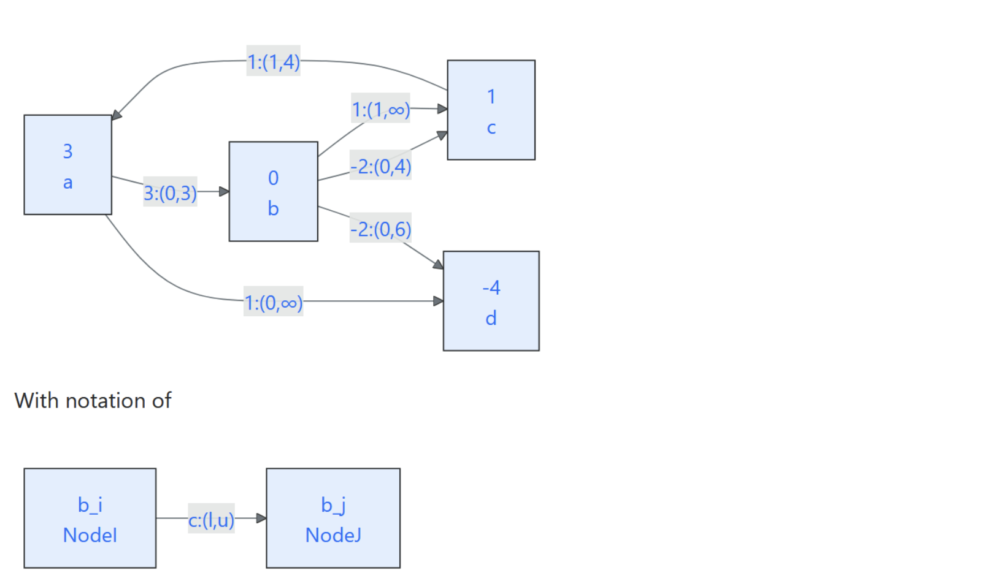

# HW 3
# 5


## a
For this problem I will use a series of $+=$ for each variable to show how an individual path/flow affects the flow on an individual arc. At the end I will sum everything up and ensure there are no violations of upper/lower bounds.

From $(a,b,c,a)$:

> $x_{ab}+=2,x_{bc}+=2, x_{ca}+=2$

From $(a,d)$:

> $x_{ad}+=2$

From $(a,b,d)$:

> $x_{ab}+=1,x_{bd}+=1$

From $(c,a,d)$:

> $x_{ca}+=1,x_{ad}+=1$

Thus it follows that:

- $0\leq x_{ab}=3 \leq 3$
- $0\leq x_{ad}=3 \leq \infty$
- $0\leq x'_{bc}=0 \leq 4$
- $1\leq x_{bc}=2 \leq \infty$
- $0\leq x_{bd}=1 \leq 6$
- $1\leq x_{ca}=3 \leq 4$

Therefore this flow is feasible


## d
For starters, fractional optimal flows do not violate the flow integrality theorem because the theorem only states the existence of an integer optimal flow and does not imply that all optimal flows are integer.

From the previous homework, we know that the optimal objective is $10$ so we should keep this in mind when solving for our fractional optimal solution. 

$x_{ab}=1.5,x_{bc}=1,x_{ca}=2,x_{ad}=3.5,x_{bd}=0.5$ results in an objective of $4.5+1+2+3.5-1=10$

> Note that $x_{bc}$ will refer to the $b,c$ arc with cost $1$ and $x'_{bc}$ refers to the $b,c$ arc with cost $-2$ although the latter is not used

## e

::: {.callout-note}
Forgot to add the path back from $c$ to $b$
:::

First the main thing it wants to change is to remove the pair of parallel arcs on $bc$. We can do this by performing cost reversal on the arc $x'_{bc}$ because it has an upperbound. This leaves us with an equivalent network flow problem that has one pair of symmetric arcs, no parallel arcs, one non zero lower bound and one arc with a negative cost. Essentially, for our flipped arc we are sending max flow on $x'_{bc}$ and now $x_{cb}$ represents how much flow we send back.

```{mermaid}
flowchart LR
  a["3<br>a"]
  b["-4<br>b"]
  c["5<br>c"]
  d["-4<br>d"]

  a-->|"3:(0,3)"|b
  b-->|"1:(1,∞)"|c
  c-->|"1:(1,4)"|a
  b-->|"-2(0,6)"|d
  c-->|"2:(0,4)"|b
  a-->|"1:(0,∞)"|d
```

Now for the **5.a** conversion. Since $x'_{bc}=0$ we must send back all the flow thus $x_{cb}=4$. Since this was the only arc changed the rest of the arcs stay the same.

Thus it follows that:

- $0\leq x_{ab}=3 \leq 3$
- $0\leq x_{ad}=3 \leq \infty$
- $0\leq x'_{bc}=0 \leq 4\rightarrow 0\leq x_{cb}=4 \leq 4$
- $1\leq x_{bc}=2 \leq \infty$
- $0\leq x_{bd}=1 \leq 6$
- $1\leq x_{ca}=3 \leq 4$

Thus as paths / cycles:

- $(a,b,c,a)=2$
- $(a,d)=2$
- $(c,b)=4$
- $(c,a,d)=1$
- $(a,b,d)=1$

## f
The given original problem meets all of the proposed requirements (at least pair of parallel arcs, at least one non zero lower bound, at least one negative cost, and no symmetric arcs). As such we can simply recreate the original network with a new arc from $d$ to $c$ with a cost of $0$. We know that doing this works for this network because $d$ is the only sink node so sending flow away from $d$ will only increase the objective (leading to a non optimal flow).

```{mermaid}
flowchart LR
  a["3<br>a"]
  b["0<br>b"]
  c["1<br>c"]
  d["-4<br>d"]

  a-->|"3:(0,3)"|b
  b-->|"1:(1,∞)"|c
  c-->|"1:(1,4)"|a
  b-->|"-2(0,6)"|d
  b-->|"-2:(0,4)"|c
  a-->|"1:(0,∞)"|d
  d-->|"0:(0,∞)"|c
```

Now for the **5.a** conversion. Since only added an arc, that arc has $0$ flow and the rest of the arcs stay the same.

Thus it follows that:

- $0\leq x_{ab}=3 \leq 3$
- $0\leq x_{ad}=3 \leq \infty$
- $0\leq x'_{bc}=0 \leq 4$
- $1\leq x_{bc}=2 \leq \infty$
- $0\leq x_{bd}=1 \leq 6$
- $1\leq x_{ca}=3 \leq 4$
- $0\leq x_{dc}=0 \leq \infty$

Thus as paths / cycles:

- $(a,b,c,a)=2$
- $(a,d)=2$
- $(c,a,d)=1$
- $(a,b,d)=1$

## g

::: {.callout-note}
No paths and Cycles
:::

We can build off of what was done in **5.e** because we already removed one negative arc. We also need to flip the cost of $bd$ by the same methods as before but we also need to remove the symmetric arcs on $bc$ but also we need to add parallel arcs. We can add a temp node to remove the symmetric arcs and we can add two different arcs from $c$ to $temp$ in order to satisfy the parallel arc constraint.

```{mermaid}
flowchart LR
  a["3<br>a"]
  b["-10<br>b"]
  c["5<br>c"]
  d["2<br>d"]
  t["0<br>temp"]

  a-->|"3:(0,3)"|b
  b-->|"1:(1,∞)"|c
  c-->|"1:(1,4)"|a
  d-->|"2(0,6)"|b
  c-->|"10:(0,1)"|t
  c-->|"0:(0,∞)"|t
  t-->|"2:(0,4)"|b
  a-->|"1:(0,∞)"|d
```

Now for the **5.a** conversion. Since $x'_{bc}=0$ we must send back all the flow thus $x_{cb}=4$. Since this was the only arc changed the rest of the arcs stay the same.

Thus it follows that:

- $0\leq x_{ab}=3 \leq 3$
- $0\leq x_{ad}=3 \leq \infty$
- $0\leq x'_{bc}=0 \leq 4$ (this constraint no longer exists just here to show work)
  - $\rightarrow 0\leq x_{ct}=4 \leq \infty$
  - $\rightarrow 0\leq x_{tb}=4 \leq 4$
- $0\leq x'_{ct}=0 \leq 4$
- $1\leq x_{bc}=2 \leq \infty$
- $0\leq x_{bd}=1 \leq 6\rightarrow 0\leq x_{db}=5 \leq 6$
- $1\leq x_{ca}=3 \leq 4$


Therefore as paths and cycles:

- $(a,b,c,a)=2$
- $(a,d,b)=2$
- $(c,t,b)=4$
- $(c,a,d,b)=1$
- $(a,b)=1$
- $(d,b)=2$


## h

::: {.callout-note}
No paths & cycles

Also missing parallel and sym arcs
:::

Here we are going to remove any lower bounds. We do this by adding a middle node with a sink of the lower bound and increase the right node's supply by the lower bound. The arc from left to middle is $c_{ij}:(0,u_{ij})$ and the arc from middle to right is $0:(0,\infty)$

We can add parallel and symmetrric arcs by adding in arcs with high costs

```{mermaid}
flowchart LR
  a["4<br>a"]
  b["0<br>b"]
  c["2<br>c"]
  d["-4<br>d"]
  m["-1<br>m(bc)"]
  n["-1<br>m(ca)"]

  a-->|"3:(0,3)"|b
  b-->|"1:(0,∞)"|m
  m-->|"0:(0,∞)"|c
  c-->|"1:(0,4)"|n
  c-->|"10:(0,1)"|n
  n-->|"10:(0,1)"|c
  n-->|"0:(0,∞)"|a
  b-->|"-2(0,6)"|d
  b-->|"-2:(0,4)"|c
  a-->|"1:(0,∞)"|d
  d-->|"0:(0,∞)"|c
```

Thus it follows that:

- $0\leq x_{ab}=3 \leq 3$
- $0\leq x_{ad}=3 \leq \infty$
- $0\leq x_{bc}=0 \leq 4$
- $0\leq x_{bm(bc)}=2 \leq \infty$
- $0\leq x_{m(bc)c}=1 \leq \infty$
- $0\leq x_{bd}=1 \leq 6$
- $0\leq x_{cm(ca)}=3 \leq 4$
- $0\leq x'_{cm(ca)}=0 \leq 4$
- $0\leq x_{m(ca)c}=0 \leq 4$
- $0\leq x_{m(ca)a}=2 \leq \infty$
- $0\leq x_{dc}=0 \leq \infty$


Therefore as paths and cycles:

- $(a,b,m(bc))=1$
- $(a,b,m(bc),c,m(ca))=1$
- $(a,b,d)=1$
- $(a,d)=1$
- $(c,m(ca),a,d)=2$


## i
### 1

::: {.callout-note}
Missing Paths & Cycles
:::

The only change here from **h** is flipping negative costs. So we simply build off from there and get the resulting network

```{mermaid}
flowchart LR
  a["4<br>a"]
  b["-10<br>b"]
  c["6<br>c"]
  d["2<br>d"]
  m["-1<br>m(bc)"]
  n["-1<br>m(ca)"]

  a-->|"3:(0,3)"|b
  b-->|"1:(0,∞)"|m
  m-->|"0:(0,∞)"|c
  c-->|"1:(0,3)"|n
  n-->|"0:(0,∞)"|a
  d-->|"2(0,6)"|b
  c-->|"2:(0,4)"|b
  a-->|"1:(0,∞)"|d
  d-->|"0:(0,∞)"|c
```

Thus it follows that:

- $0\leq x_{ab}=3 \leq 3$
- $0\leq x_{ad}=3 \leq \infty$
- $0\leq x_{cb}=4 \leq 4$
- $0\leq x_{bm(bc)}=2 \leq \infty$
- $0\leq x_{m(bc)c}=2 \leq \infty$
- $0\leq x_{db}=5 \leq 6$
- $0\leq x_{cm(ca)}=3 \leq 4$
- $0\leq x_{m(ca)a}=3 \leq \infty$
- $0\leq x_{dc}=0 \leq \infty$

Therefore as paths and cycles:

- $(a,b,m(bc))=1$
- $(a,b,m(bc),c,m(ca))=1$
- $(a,b)=1$
- $(a,d,b)=1$
- $(c,b)=4$
- $(c,m(ca),a,d,b)=2$
- $(d,b)=2$

### 2
```{mermaid}
flowchart LR
  a["4<br>a"]
  b["-10<br>b"]
  c["6<br>c"]
  d["2<br>d"]
  m["-1<br>m(bc)"]
  n["-1<br>m(ca)"]

  b-->|"-3:(0,3)"|a
  b-->|"1:(0,∞)"|m
  m-->|"-1:(0,2)"|b
  m-->|"0:(0,∞)"|c
  c-->|"0:(0,2)"|m
  c-->|"1:(0,1)"|n
  n-->|"-1:(0,3)"|c
  n-->|"0:(0,∞)"|a
  a-->|"0:(0,3)"|n
  d-->|"2(0,1)"|b
  b-->|"-2(0,5)"|d
  b-->|"-2:(0,4)"|c
  a-->|"1:(0,∞)"|d
  d-->|"-1:(0,3)"|a
  d-->|"0:(0,∞)"|c
```

### 3

::: {.callout-note}
Error
:::

A bit confusing because this mentions using an optimal $x^*$ but the flow in **a** is certainly not optimal. As such I will proceed with my response to **5.b** from the previous hw: 

> $x_{ab}=1,x_{bc}=1,x_{ca}=2,x_{ad}=4$ results in an objective of $10$

On this network translates to:

> $x_{ab}=1$
> $x_{bm(bc)}=1$
> $x_{cm(ca)}=2$
> $x_{m(ca)a}=2$
> $x_{ad}=4$
> $x_{db}=6$
> $x_{cb}=3$

The comp slack conditions are:

> $x_{ij}c_{ij}^\pi =0, ((i,j)\notin U)\rightarrow x_{ij}(c_{ij}-\pi_i + \pi_j)=0$ 
>
> $x_{ij}(c_{ij}+\alpha_{ij})^\pi =0, ((i,j)\in U)\rightarrow x_{ij}(c_{ij}-\pi_i + \pi_j+[-c_{ij}^\pi]^+)=0$  
>
> $\alpha_{ij}(u_{ij}-x_{ij})=0, ((i,j)\in U) \rightarrow [-c_{ij}+\pi_j - \pi_i]^+(u_{ij}-x_{ij})=0$ 

$c_{ij}^\pi=0$ for non zero flows (no upperbound) and $c_{ij}\geq 0$ for flows who have an upperbound and are not at it. Specifically if $x_{ij}\neq 0$ and no upperbound then $\pi_i-\pi_j = c_{ij}$. Starting off with that we get an example node potentials of:

> $\pi_a-\pi_d=1$
> $\pi_a=1$
> $\pi_d=0$
> $\pi_{m(ca)}=\pi_a=1$
> $\pi_{m(bc)}=\pi_b$

For arcs with an upperbound and nonzero flows, if the arc is not at max flow then $\pi_j-\pi_i \leq c_{ij}$ 

> $\pi_b - \pi_a \leq 1 \rightarrow \pi_b \leq 2$ so we can just assign it as $2$ along with $\pi_{m(bc)}$
> $\pi_c - \pi_b \leq 2 \rightarrow \pi_c \leq 4$ so we can just assign it as $4$

Thus: 

> $\pi_a=1$
> $\pi_d=0$
> $\pi_{m(ca)}=1$
> $\pi_{m(bc)}=2$
> $\pi_b=2$
> $\pi_c=4$

And: 

> $c_{ad}^\pi = 0$
> $c_{ab}^\pi = 4$
> $c_{bm(cb)}^\pi = 1$
> $c_{m(bc)c}^\pi = 2$
> $c_{cm(ca)}^\pi = -2$
> $c_{m(ca)a}^\pi = 0$
> $c_{db}^\pi = 4$
> $c_{dc}^\pi = 4$
> $c_{cb}^\pi = 0$

## j
The only change here from **i** is removing upperbounds. So we simply build off from there and get the resulting network

```{mermaid}
flowchart LR
  a["1<br>a"]
  b["-10<br>b"]
  c["-2<br>c"]
  d["-4<br>d"]
  m["-1<br>m(bc)"]
  n["-1<br>m(ca)"]
  e["3<br>e"]
  f["4<br>f"]
  g["6<br>g"]
  h["4<br>h"]

  e-->|"0:(0,∞)"|a
  e-->|"3:(0,∞)"|c
  b-->|"1:(0,∞)"|m
  m-->|"0:(0,∞)"|c
  f-->|"1:(0,∞)"|n
  f-->|"0:(0,∞)"|c
  n-->|"0:(0,∞)"|a
  g-->|"2:(0,∞)"|b
  g-->|"0:(0,∞)"|d
  h-->|"2:(0,∞)"|b
  h-->|"0:(0,∞)"|d
  a-->|"1:(0,∞)"|d
  d-->|"0:(0,∞)"|c
```

# HW 4

::: {.callout-note}
Formalize
:::

# 1
From the linear program, we see that there are $q$ $x_j$'s that are summed with eachother at different intervals ($s_i$ to $t_i$) and must be at least $b_i$. The objective function was defined as $\min \sum_{j=1}^q c_j x_j$. 

Assume we have a basic setup of $q$ nodes that are strung together sequentially (since all sums are on sequential $x$), for now all containing $0$ costs infinite upper bounds and $0$ lower bound. $x_q$ has an arc to a new node $s$, again no costs or upper bound, and $s$ has arcs to each $x$ with costs $c_j$. However, I am not able to think about a way in which to assess a sum of flows across the nodes while preserving sums of other different flows. On the other hand, we know a constraint $i$ is satisfied if the amount of flow leaving $x_{ti}\geq b_i + x_{si}$. Since this is looking at constraints and the difference in node potentials, maybe we can try taking the dual: 

$\max \sum_{i=1}^p b_i y_i$

s.t. $\sum_{\forall i: si \leq j \leq ti} y_i \leq c_j, \quad (j=1,...,q)$

> $y\geq 0$

We can view this visually as $a_{ji}= 0 \leftrightarrow j< s_i \lor j > t_i$ and $a_{ji}= 1 \leftrightarrow s_i \leq j \leq t_i$. In other words, if we look at a single column $i$, it is a column of $1$'s in the interval when $[s_i,t_i]$ and $0$ outside this interval. Suppose this matrix is $A$, thus we have $Ay\leq c$. To convert this to equalities, we can add slack variables $s$ thus $Ay + Is = c$. 

While this looks much better than the original problem, we still need to create the node incidence arc matrix where each variable $y$ and $s$ have a single $-1$ entry and a single $1$ entry with the rest at $0$. We can actually get this through gaussian transformations since the columns have $1$'s only in a single interval. Starting by adding a new row at the top of $0^T ys= 0$, and from here row $j=$ the original row $j$ - original row $j+1$ for $j\in \{0,q-1\}$. 

Thus our resulting matrix will cancel out any intermediate $1$'s in a column and we will be left with a $-1$ at row $s_i-1$ and a $1$ at row $t_i$. Additionally, the slack variables now are easily viewed as arcs that sequentially string along the $q+1$ nodes (note that these are $0$ indexed) and have a cost of $0$. Now the $y$ arcs are from $s_i-1$ to $t_i$ with a cost of $-b_i$ (to make it a minimization problem). Now the supplies / demands at the $q+1$ nodes are calculated as $c_j-c_{j+1}$ for $j\in \{0,...,q-1\}$ where $c_0=0$. 

For a sanity check we can check to make sure these supplies sum to $0$. Since each supply is formulated as $c_j-c_{j+1}$, it is clear that all the $c_j$'s cancel out except for $c_0$ which is $0$. Thus the sum of all the supplies are $0$.

Now since I have explained on how to generate the MCNF, how we use this to solve for our original LP is simply following solving the MCNF for our $y^*$, then using complementary slackness to find $x^*$ by solving that system of linear equations. 

# HW 5
# 1
## a
This reduction is quite similar to the weighted interval scheduling to shortest paths.

We start with creating $n$ nodes and we are trying to find the shortest path from node $1$ to node $n$. We can attatch arcs from node $i$ to node $i+1$ with cost $0$ to ensure a feasible solution. Then for each arc $(i,j)$ in the arc set $A$, we put an arc from node $i$ to node $j+1$ (with the exception of $j=n$, in which case the arc goes to the node $n$) with a cost of $-1$. Thus when trying to find the shortest path, the shortest path algorithm will take as many of these arcs with cost $-1$ which is the same as trying to find the most amount of arcs in a set that do not conflict.

We know arcs are non conflicting in the shortest paths algorithm because in order for an arc $(i_1,j_1)$ to be conflicting with another arc $(i_2,j_2)$ then $i_1 \leq i_2 \leq j_1 \leq j_2$. In the case of our graph construction, it is not possible to take arcs that satisfy these inequalities because the only way for a path to take 2 arcs that conflict is if $j_1=i_2$, which is why the arcs go from $i_1$ to $j_1+1$ to prevent a path from taking conflicting arc. In other words, we need the $j+1$ because unlike the WIS problem we are not allowed to have an arc that stops and then use another arc on the same node. Thus the $+1$ for the ending part of an arc forces the paths to only take arcs once it is no longer conflicting with the previous arc taken.

Additionally given the extra constraint of $\forall$ arcs, $i\leq j$, then we know that taking any path allows increases our node number essentially moving "forward" so we know that we never have a cycle allowing for a negative infinite path. To finish the reduction, the optimal objective would be equal to the most amount of non conflicting arcs in a set (times $-1$). The actual arcs choosen would be the arcs $i,j+1$ that are part of the shortest path.

### Proof of correctness:
Suppose $\exists O\subset A$ as the maximum non-conflicting arc subset:

> This means in our graph construction, all the edges $e\in O$ would be takeable in the same path from node $1$ to $n+1$. This is because in our graph construction, by taking an edge along a path we prevent taking any conflicting arcs during the same paths. Thus, our shortest path would be the one which takes all edges in $O$ resulting in an optimal path corrersponding to the same arcs in $O$. Suppose $\exists S$ a path which is shorter than this path (|legnth of $S$| > $|O|$), then this path takes more of the side paths indicating a larger amount of non conflicting arcs than the arcs in $O$. This suggests a more optimal solution than $O$ which is not possible creating a contradiction.

Suppose $\exists P$ as the shortest path in our graph:

> This means that our path took the most amount of negative costing edges. Suppose the negative length edges in this path is a set $N$. Thus the each edge $(i,j+1)\in N$ corresponds to the arc $(i,j)\in A$ thus creating an optimal subset $O\subset A$. We know this is optimal by proof by contradiction. Suppose $\exists O'$ which is a set of nonconflicting arcs in $A$ that is larger than $O$. Then it corresponds to a negative edges in our graph and these edges would be non conflicting. This means they could all be taken in the same path. If they are taken in the same path then we end up with a path which is shorter than our optimal path $P$ which creates a contradiction.

## b

::: {.callout-note}
Idea is right, however we can't just assume $n$ is a constant. Thus we instead generate the vertices and order them first by their index then if it is a start point or an end point. Thus means we end up creating $2|A|$ vertices which is now independent of $n$. The splitting idea still plays out with instead trying to split by the starting nodes as opposed to individual $n$ vertices.
:::

The problem from HW1 states that the input is "given a set $A$ of $n$-arcs", thus as long as the algorithm runs in polynomial time with respect to $|A|$ then the algorithm would run in polynomial time. Thus in our case $n$ is a constant and not actually the size of the input.  

Our algorithm would run similarly to the shortest paths reduction above, except we need to account for cases in which the $n$-arcs loop around (ie $j < i$). We can do this by running a series of shortest paths algorithms (which was discussed to be polynomial time) on $n$ different graphs. Consider a graph of $n$ vertices that are connected sequentially (node $i$ has an outgoing arc to node $i+1$) with an additional arc from node $n$ to node $1$. All of these arcs have $0$ cost. Next, add the $n$-arcs onto our graph with the same rules as in **1.a** which is an $n$-arc $(i,j)$ creates an arc from node $i$ to node $j+1$ with a cost of $-1$. 

Now for determining the maximal non-conflicting arc set problem, we run the shortest paths algorithm on slightly modified versions of this graph. We start by adding a new target node $t$ with each run of the shortest paths, from an original node $i$ to $t$ and all edges that are incoming to $i$ we instead point to $t$ (including the $0$ cost edges). To prevent use of any conflicting arcs from both being used in the path, we remove any edge that effectively points "backwards" in our line (since we essentially unwrapped the circle into different sequential lines). This runs the shortest paths algorithm $n$ times and then the maximal non-conflicting arc set corresponds to the shortest path of all of the paths on the $n$ different graphs. 

> Note that an edge that points "backwards" in one of these modified graph does not point "backwards" in all modified graphs. Suppose there is an arc where $j+1 \leq i$, then if our start node $s$ satisfies the inequalities $j+1\leq s \leq i$ then this arc would appear to point forward in this line and could be used in an optimal shortest path for this graph. By doing these different graph splits, essentially we are shifting over all the indicies of the arcs in the circle looking for an optimal one.

Thus the runtime is $O(nS+G)$ where $n$ is from the $n$-arcs, $S$ is the runtime for the shortest paths algorithm, and $G$ is the time for constructing the graph. We know that $G=O(n+m)$ where $m=|A|$ because that is the amount of time it takes to create the edges. 

# 2
## a
We can better visualize this problem as $Ay$ where the individual rows of this matrix add up to $u$ and the individual columns add up to $v$. Specifically the sum of the first row of $Ax$ should be equal to $u_1$ and so on (same with columns). Now our goal is to prove that if $Bx$ has a solution (given the same row and column summation constraints) then $Ay$ must also have a solution. 

This is quite simple since $\forall a_{ij}\neq 0, b_{ij}=1=a_{ij}/a_{ij}$. Thus, $b_{ij}x_{ij}=a_{ij}y_{ij}\rightarrow x_{ij}=a_{ij}y_{ij}$. This makes intuitive sense because $b_{ij}=0$ when $a_{ij}=0$, meaning that the values of $x_{ij},y_{ij}$ cannot contribute to their respective sums. On the other hand, when $b_{ij},a_{ij}\neq 0$ the steps shown before how to solve for $y_{ij}$ or $x_{ij}$ from the other. 

More formally, if $\exists x$ that is feasible, then $\forall i\in p, \sum_{j=1}^q b_{ij}x_{ij} = u_i\land \forall j\in q, \sum_{i=1}^p b_{ij}x_{ij} = v_j$. Since $B$ and $A$ have the same $0$ entries, we ignore those respective $x$ and $y$. For any nonzero entry, we apply the same formula above to find $x_{ij}=a_{ij}y_{ij}$ will result in a feasible solution because $\forall i\in p, \sum_{j=1}^q b_{ij}x_{ij} = u_i\land \forall j\in q, \sum_{i=1}^p b_{ij}x_{ij} = v_j\rightarrow \forall i\in p, \sum_{j\in q \land bij\neq 0} x_{ij} = u_i\land \forall j\in q, \sum_{i\in p \land bij\neq 0} x_{ij} = v_j \rightarrow \forall i\in p, \sum_{j=1}^q a_{ij}y_{ij} = u_i\land \forall j\in q, \sum_{i=1}^p a_{ij}y_{ij} = v_j$. Thus, if $\exists x$ that is feasible then $\exists y$ that is feasible. Additionally the proof is very similar, but mirrored for if $\exists y$ that is feasible then there exists a feasible $x$.

> Note the last $\rightarrow$ is because $B$ and $A$ have the same $0$ entries. 

For the other direction, if $\nexists y$ that is feasible then $\nexists x$ that is feasible. This proof is quite simple with a proof by contradiction, suppose there is no feasible $y$ but there is a feasible $x$, then the steps above would outline how to find a feasible $y$ from our feasible $x$. This creates a contradiction because we started with there not existing a feasible $y$. Therefore this creates a contradiction. Similar steps to show that if $\nexists x$ feasible then $\nexists y$ feasible.

Thus $x$ has a feasible solution in those system of equations iff $y$ has a solution in the original system of equations.


## b

::: {.callout-note}
kerchoo no lower bounds. instead we remove all parts with lower bounds and keep all the upper bounds. Then the return arc from $t$ to $s$ has a negative cost and we know our solution is feasible iff that arc is saturated
:::

We can construct the graph as a bipartite one where $V_1$ consist of $p$ nodes and $V_2$ consists of $q$ nodes. The nodes in $V_1$ correspond to the rows of $Bx$ and the nodes in $V_2$ correspond to the columns of $Bx$. We assign arcs from each node in $V_1$ to each node in $V_2$. These arcs then represent $x_{ij}$ where $i$ is the row and $j$ is the column.We remove any edge $(i,j), i\in V_1 \land j\in V_2$ where $b_{ij}=0$ (ensures that these edges aren't making an infeasible problem feasible). By our feasibility shown in **2.a**, we know that these flows $x_{ij}$ can correspond to a feasible solution $y_{ij}$. These arcs have no lower or upper bound, since this is a circulation feasibility problem we can assume all $0$ costs. 

To induce a flow, we can create a new source node which has outgoing arcs to all the nodes in $V_1$ and all the nodes in $V_2$ point to the source node. Each of the outgoing arcs from the source to a node $i\in V_1$ has a lower bound of $u_i$, and similarly an arc from node $j\in V_2$ to the source node has a lower bound of $v_j$. Since we are given that $\sum_{i=1}^p u_i = \sum_{j=1}^q v_j$ we know that these ingoing and outgoing arcs will lead to a $0$ circulation. 

Since the circulation problem ends with all nodes having a $0$ supply excess, we know that since each node $i\in V_1$ have an excess of $u_i$ so $u_i - \sum_{j=1}^q x_{ij} =0$. Similarly, since each node $j\in V_2$ have a deficit of $v_j$ so $-v_j +\sum_{i=1}^p x_{ij} =0$. Thus if there is a feasible solution then the values of $x_{ij}$ directly correspond to a feasible solution of $x_{ij}$ in **2.a** which was discussed to prove a feasible solution in the original problem.

### Proof of correctness:
Suppose you have feasible matrix $x$ that satisfies the constraints:

> This means that the sum of rows of $x$ (excluding $x_{ij}$ where $b_{ij}=0$) result in the vector $u$ and that sum of the columns of $x$ result in the vector $v$. In our graph, we are inducing excess of $u_i$ to the $i$th node of $V_1$ which is equivalent to the $i$th row of $x$. Additionally, our graph has an induced deficit of $v_j$ to the $j$th node of $V_2$ which is equivalent to the $j$th column of $x$. Since its given that there is a feasible $x$ that satisfies $\forall i: \sum_j b_{ij}x_{ij}= u_i, \land \forall j: \sum_i b_{ij}x_{ij}= v_j$. Since our circulation is looking for all $0$ excess: $\forall i: u_i - \sum_{j: b_{ij}\neq 0} x_{ij} = 0, \land \forall j: - v_j + \sum_{i: b_{ij}\neq 0} x_{ij}=0$ which is easily derived from the feasibility of $x$. Thus if $\exists x$ that is feasible then $\exists$ feasible circulation. 

Suppose you have a feasible circulation $x$:

> Then $x$ satisfies the constraints $\forall i: u_i - \sum_{j: b_{ij}\neq 0} x_{ij} = 0, \land \forall j: - v_j + \sum_{i: b_{ij}\neq 0} x_{ij}=0$. This is easily translated to $\forall i: \sum_j b_{ij}x_{ij}= u_i, \land \forall j: \sum_i b_{ij}x_{ij}= v_j$ meaning that we use the flows on $x$ in our graph to determine a feaible $x$ for the constraints (which are then used to find $y$).

Suppose there is no feasible matrix $x$ that satisfy the given contraints. Then we can do proof by contradiction and assume there $\exists$ a feasible circulation flow.

> If there exists a feasible flow in our network graph, we can see from above that there should also be an $x$ to satisfy the constraints in **2.a**. This creates a contradiction because our initial premise is that there is not a feasible solution. Therefore this creates a contradiction.

Suppose there is no feasible circulation flow that satisfy the given contraints. Then we can do proof by contradiction and assume there $\exists$ a feasible $x$ that satisfies the constraints in **2.a**.

> If there exists an $x$ that satisfies **2.a**, we can see from above that this can be used to derive a feasible circulation flow from $x$. This creates a contradiction because our initial premise is that there is not a feasible circulation flow. Therefore this creates a contradiction.


# 3

::: {.callout-note}
Idea is right but didnt actually write out an algorithm lol

Essentially we create intervals based on jobs available and number machines available such that the num jobs and machines do not change in each interval. Now we look at each interval where the compute power is in excess of the required processing power and adjust everything accordingly. Then we essentially create a new instance of WIS and repeat the above steps recursively. 
:::

The scheduling reduction fails quite similarly to the one discussed in class, except we also have to partition the intervals on the differing machines active. Thus we can compute the total compute power of an interval as the length of the interval multiplied by the number of machines in that interval (constant since we partitioned on machine intervals). 

| i | 1 | 2 | 3 | 4 |
| -- | -- | -- | -- | -- |
| $p_i$ | 1.5 | 1.25 | 2.1 | 3.6 |
| $r_i$ | 3 | 1 | 3 | 5 |
| $r_i$ | 5 | 4 | 7 | 9 |

With machines as 

| Interval | Num Machines |
| --- | --- |
| [1,3] | 3 |
| [3,4] | 2 |
| [4,6] | 3 |
| [6,7] | 2 |
| [7,11] | 4 |

We build off of these intervals to now partition on the different intervals of jobs active during those times and the total processing time at each interval

| Interval | Num Machines | Jobs Active | Interval Length | Max Processing Power |
| --- | --- | --- | --- | ---- |
| [1,3] | 3 | 2 | 3 | 9 |
| [3,4] | 2 | 1,2,3 | 1 | 2 |
| [4,5] | 3 | 1,3 | 1 | 3 |
| [5,6] | 3 | 3,4 | 1 | 3 |
| [6,7] | 2 | 3,4 | 1 | 2 |
| [7,9] | 4 | 4 | 2 | 8 |

Now on each of these intervals we look at how many jobs are in excess of the number of machines. For any other interval we are able to string jobs like in the original WIS problem where you start processing a job during this interval, once this one ends (or we reach the end of the interval), we start the processing the next job. If this subsequent job reaches the end of the interval then we restart at the begining of the interval with the previous steps as before. Since for these intervals we have the constraint that the number of machines is greater than or equal to the number of jobs on this interval, we know that in this interval we either process a job for the length of the interval OR complete the job. We also know there is no overlap of a machine running the same job as another machine at the same time (ie running in parallel) because for each job we process at most the length of the interval with the same stacking method as shown in class. 

Thus we can create a new table indexed on the intervals and the columns represent the processing time occured for the corrersponding job in that interval (after only the steps above).

| Interval | $p_1$ in int | $p_2$ in int | $p_3$ in int | $p_4$ in int | 
| --- | --- | --- | --- | --- |
| [1,3] | 0 | 1.25 | 0 | 0 |
| [3,4] (skip for now) | 0 | 0 | 0 | 0 |
| [4,5] | 1 | 0 | 1 | 0 |
| [5,6] | 0 | 0 | 1 | 1 |
| [6,7] | 0 | 0 | 0.1 | 1 |
| [7,9] | 0 | 0 | 0 | 1.6 |

Essentially now the algorithm would find out which jobs are remaining and which intervals still have available compute power. Thus we would construct a new WIS on varying number of unifrom parallel machines. However our recursive problem would be slightly different where some jobs have non continuous intervals where they can be processed (ie not one start and stop time). This is because a job could be part of two disjoint intervals where the number of jobs was greater than the number of machines. Thus in our case our new jobs are:

| i | 1 | 2 | 3 | 4 |
| -- | -- | -- | -- | -- |
| $p_i$ | 0.5 | 0 | 0 | 0 |
| intervals | [3,4] | [2.25,4] | [3,4],[6.1,9] | [8.4,9] |

With machines, we need to subtract the number of jobs that used the full interval from the number of machines in that interval. If a job did not use the full interval and instead ended then we would partition the interval on the amount of processing that happened on that job (note that this means after the partition part of the interval could have $0$ machines available while the other part would be $1$).

| Interval | Num Machines |
| --- | --- |
| [1,2.25] | 2 |
| [2.25,3] | 3 |
| [3,4] | 2 |
| [4,6] | 1 |
| [6,6.1] | 0 |
| [6.1,7] | 1 |
| [7,8.6] | 3 |
| [8.6,11] | 4 |

Now the final step of this iteration is again to partition the intervals on machine intervals and job intervals. Here tho when listing jobs in an interval we skip any jobs with $0$ processing time remaining.


| Interval | Num Machines | Jobs Active | Interval Length |
| --- | --- | --- | --- |
| [3,4] | 2 | 1 | 1 |

Thus our algorithm ends here with a machine processing the $0.5$ remaining time for job $1$. Although this is not the case for this example, the algorithm would repeat until there are intervals with jobs that still need to be processed but no more compute available.


# Q4

```{mermaid}
flowchart LR
  a["4<br>a"]
  b["-11<br>b"]
  c["5<br>c"]
  d["2<br>d"]
  e["0<br>e"]

  a-->|"3:(0,3)"|b
  a-->|"1:(0,∞)"|d
  b-->|"1:(0,∞)"|c
  c-->|"1:(0,3)"|a
  c-->|"2:(0,4)"|e
  d-->|"2:(0,6)"|b
  e-->|"0:(0,4)"|b
```

with notation as:

```{mermaid}
flowchart LR
  i["e_i<br>pi_i<br>i"]
  j["e_j<br>pi_j<br>j"]

  i-->|"c:(0,u_{ij}),c^\pi"|j
```

If we start with $s=a$, thus $\pi_a=0$, and $t=b$ and $x=0$ we get the below $G(x)$ and calculating $c_{ij}^\pi=c_{ij}-\pi_i+\pi_j=c_{ij}+d_i-d_j$:

```{mermaid}
flowchart LR
  a["4<br>0<br>a"]
  b["-11<br>-3<br>b"]
  c["5<br>-4<br>c"]
  d["2<br>-1<br>d"]
  e["0<br>-6<br>e"]

  a-->|"3:(0,3),0"|b
  a-->|"1:(0,∞),0"|d
  b-->|"1:(0,∞),0"|c
  c-->|"1:(0,3),5"|a
  c-->|"2:(0,4),0"|e
  d-->|"2:(0,6),0"|b
  e-->|"0:(0,4),3"|b
```

Here we see there are 2 shortest paths from $a$ to $b$ so we can start by just taking $x_{ab}$. On this path, the most amount of flow we can send is $3$ because of the upper bound so lets update $x$, $e_{i}$ and $G(x)$


```{mermaid}
flowchart LR
  a["1<br>0<br>a"]
  b["-8<br>-3<br>b"]
  c["5<br>-4<br>c"]
  d["2<br>-1<br>d"]
  e["0<br>-6<br>e"]

  b-->|"3:(0,3),6"|a
  a-->|"1:(0,∞),0"|d
  b-->|"1:(0,∞),0"|c
  c-->|"1:(0,3),5"|a
  c-->|"2:(0,4),0"|e
  d-->|"2:(0,6),0"|b
  e-->|"0:(0,4),3"|b
```

Since $a$ still has excess and $b$ still has deficit we repeat again this time along the path $a\rightarrow d\rightarrow b$. Here we only send $1$ unit of flow because that bottoms out all of the excess at $a$.


```{mermaid}
flowchart LR
  a["0<br>0<br>a"]
  b["-7<br>-3<br>b"]
  c["5<br>-4<br>c"]
  d["2<br>-1<br>d"]
  e["0<br>-6<br>e"]

  b-->|"-3:(0,3),0"|a
  a-->|"1:(0,∞),0"|d
  d-->|"-1:(0,1),0"|a
  b-->|"1:(0,∞),0"|c
  c-->|"1:(0,3),5"|a
  c-->|"2:(0,4),0"|e
  d-->|"2:(0,5),0"|b
  b-->|"-2:(0,1),0"|d
  e-->|"0:(0,4),3"|b
```

Now lets choose $s=d$ and $t=b$ and recalculate our $\pi$'s and $c_{ij}^\pi$:

```{mermaid}
flowchart LR
  a["0<br>1<br>a"]
  b["-7<br>-2<br>b"]
  c["5<br>-3<br>c"]
  d["2<br>0<br>d"]
  e["0<br>-5<br>e"]

  b-->|"-3:(0,3),0"|a
  a-->|"1:(0,∞),0"|d
  d-->|"-1:(0,1),0"|a
  b-->|"1:(0,∞),0"|c
  c-->|"1:(0,3),5"|a
  c-->|"2:(0,4),0"|e
  d-->|"2:(0,5),0"|b
  b-->|"-2:(0,1),0"|d
  e-->|"0:(0,4),3"|b
```

Thus we find the shortest path from $d$ to $b$ is $d\rightarrow b$ so we send the max amount of flow which is $2$ units due to $d$ having an excess of $2$. Update:

```{mermaid}
flowchart LR
  a["0<br>1<br>a"]
  b["-5<br>-2<br>b"]
  c["5<br>-3<br>c"]
  d["0<br>0<br>d"]
  e["0<br>-5<br>e"]

  b-->|"-3:(0,3),0"|a
  a-->|"1:(0,∞),0"|d
  d-->|"-1:(0,1),0"|a
  b-->|"1:(0,∞),0"|c
  c-->|"1:(0,3),5"|a
  c-->|"2:(0,4),0"|e
  d-->|"2:(0,3),0"|b
  b-->|"-2:(0,3),0"|d
  e-->|"0:(0,4),3"|b
```


Now lets choose $s=c$ and $t=b$ and recalculate our $\pi$'s and $c_{ij}^\pi$:

```{mermaid}
flowchart LR
  a["0<br>1<br>a"]
  b["-5<br>-2<br>b"]
  c["5<br>0<br>c"]
  d["0<br>0<br>d"]
  e["0<br>-2<br>e"]

  b-->|"-3:(0,3),0"|a
  a-->|"1:(0,∞),0"|d
  d-->|"-1:(0,1),0"|a
  b-->|"1:(0,∞),3"|c
  c-->|"1:(0,3),2"|a
  c-->|"2:(0,4),0"|e
  d-->|"2:(0,3),0"|b
  b-->|"-2:(0,3),0"|d
  e-->|"0:(0,4),0"|b
```

Thus we find the shortest path from $c$ to $b$ is $c\rightarrow e\rightarrow b$ so we send the max amount of flow which is $4$ units due to arcs having an upperbound of $4$. Update $\pi_i$, $e^i$, $c_{ij}^\pi$, $G(x)$:

```{mermaid}
flowchart LR
  a["0<br>-1<br>a"]
  b["-1<br>-4<br>b"]
  c["1<br>0<br>c"]
  d["0<br>-2<br>d"]
  e["0<br>-4<br>e"]

  b-->|"-3:(0,3),0"|a
  a-->|"1:(0,∞),0"|d
  d-->|"-1:(0,1),0"|a
  b-->|"1:(0,∞),5"|c
  c-->|"1:(0,3),0"|a
  e-->|"-2:(0,4),2"|c
  d-->|"2:(0,3),0"|b
  b-->|"-2:(0,3),0"|d
  b-->|"0:(0,4),0"|e
```

Thus we make our final updates with the shortest path now from $c$ to $b$ being $c\rightarrow a\rightarrow d\rightarrow b$ with the final remaining flow of $1$. Updating everything results in:

```{mermaid}
flowchart LR
  a["0<br>-1<br>a"]
  b["0<br>-4<br>b"]
  c["0<br>0<br>c"]
  d["0<br>-2<br>d"]
  e["0<br>-4<br>e"]

  b-->|"-3:(0,3),0"|a
  a-->|"1:(0,∞),0"|d
  d-->|"-1:(0,2),0"|a
  b-->|"1:(0,∞),5"|c
  c-->|"1:(0,2),0"|a
  a-->|"-1:(0,1),0"|c
  e-->|"-2:(0,4),2"|c
  d-->|"2:(0,2),0"|b
  b-->|"-2:(0,4),0"|d
  b-->|"0:(0,4),0"|e
```

Thus using the SSP algorithm we get the following optimal path flows solution for the network:

| Path | Flow Amount |
| --- | - |
| (a,b) | 3 |
| (a,d,b) | 1 |
| (d,b) | 2 |
| (c,e,b) | 4 |
| (c,a,d,b) | 1 |

# HW 6

# 1
Let player $2$ be the minimizing player who chooses strategies $S^+=\{1,2,3,4\}$, with $x_1,x_2,x_3,x_4$ from the LP, $x_i$ corresponding to probability strategy $i$ is choosen for player $2$. This problem is that player $2$ must reveal their mix strategy, to minimize the objective function assuming that player $1$ (the maximizing player) is playing optimally. Player $1$ be the maximizing player with $S^-=\{1,2,3,4\}$ since there are 4 different terms in the objective function corresponding to the different choices player $1$ has to make. Breaking apart the first term in the objective, it is given that $3x_1+x_2+x_3+x_4$ which just means this is the expected value of $h(x,j)$ given that $j=1$ and $x$ is the probability distribution over $S^-$. Thus we can formulate our objective $h(x,y)$ as shown in the table below:

| $S^- \\ S^+$ | 1 | 2 | 3 | 4 |
| --- | - | - | - | - |
| 1 | 3 | 3/2 | 1 | 1 |
| 2 | 1 | 2 | 4/3 | 4/3 |
| 3 | 1 | 1 | 5/3 | 5/3 |
| 4 | 1 | 1 | 1 | 2 |

Thus the LP is simply that the minimizing player is revealing their mixed strategy and then the maximizing player uses an optimal pure strategy based on the minimizing mixed strategy and the objective $h(x,y)$ shown above.


# 2
$h(i,j)=\frac{b(i,j)}{a(i)}$ and $a(i)=\min_j b(i,j)$.

Thus $h(i,j)=\frac{b(i,j)}{a(i)}=\frac{b(i,j)}{\min_j b(i,j)}$

## a
Given $v^*=\min_y \max_i h(i,y)$ 

By vonNeuman theorem: $v^*=\min_y \max_i h(i,y)=\max_x \min_j h(x,j)$ 

Since this has a $\max_x$ we know $v^*\geq \min_j h(x,j)$

## b

::: {.callout-note}
Better explain the idea of $x'$
:::

Knowing off with $v^*=\max_x\min_j h(x,j)$, lets expand on our given expectations:

> $\frac{E_x[b(i,j)]}{E_x[a(i)]}= \frac{\sum_{i} x(i) b(i,j)}{\sum_k x(k)a(k)}$

We know we don't have a divide by $0$ error because $b(i,j)\geq a(i) > 0$. Thus if we are able to find a mixed strategy $x'$ that satisfies this equality then we would have this be equal to $h(x',j)$ which is less than or equal to $v^*$

Let $x'(i)=\frac{x(i)a(i)}{\sum_k x(k)a(k)}$, then:

> $h(x',j)=\sum_i x'(i)h(i,j)= \sum_i\frac{x(i)a(i)}{\sum_k x(k) a(k)}\frac{b(i,j)}{a(i)}=\sum_i\frac{x(i)b(i,j)}{\sum_k x(k) a(k)} = \frac{E_x[b(i,j)]}{E_x[a(i)]}$

We can also trivially check that $\sum_i x'(i)=1$ by seeing that the numerator and denominator are equal after adding the summations.

Thus, since by **2.a** we know that $\forall x, v^*\geq \min_j h(x,j)$ and we found an $x'$ as a valid $x$ that satisfies the constraints, we know that:

> $v^*\geq \min_j h(x',j)=\min_j \frac{E_x[b(i,j)]}{E_x[a(i)]}$

## c
We can most simply recognize $\frac{1}{E_x[\frac 1{h(i,j)}]}$ as $\frac{1}{\sum_i x(i)\frac 1{h(i,j)}}$. This can be rewritten as a weighted harmonic mean: 

> $\frac{\sum_i x(i)}{\sum_i x(i)\frac 1{h(i,j)}}= \frac{1}{\sum_i x(i)\frac 1{h(i,j)}}$

This weighted harmoonic mean is less than or equal to the arithmetic mean as $\sum_i x(i)h(i,j)$

Thus putting this together:

> $\min_j \frac{1}{E_x[\frac 1{h(i,j)}]} = \min_j \frac{1}{\sum_i x(i)\frac 1{h(i,j)}} \leq \min_j \sum_i x(i) h(i,j) = \min_j h(x,j) \leq v^*$

With the last inequality from **2.a**. Thus all **2.a,2.b,2.c** are all true inequalities

# 3
## a

::: {.callout-note}
Algorithm only adds one node at a time not both...
:::

Start with node assignments where $x_7$ be the middle node and $x_1$ be the left node in the top section and we can count up going clockwise with the node down and to the left of $x_1$ being $x_6$ and the node to the right of $x_1$ being $x_2$.

We create our linear program as follows:

$\min \sum x$

s.t. $x_1 + x_2 \geq 1$

> $x_3 + x_4 \geq 1$

> $x_5 + x_6 \geq 1$

> $x_1 + x_7 \geq 1$

> $x_2 + x_7 \geq 1$

> $x_3 + x_7 \geq 1$

> $x_4 + x_7 \geq 1$

> $x_5 + x_7 \geq 1$

> $x_6 + x_7 \geq 1$

> $x \geq 0$

And dual as:

$\max \sum y$

s.t. $y_{12} + y_{17} \leq 1$

> $y_{12} + y_{27} \leq 1$

> $y_{34} + y_{37} \leq 1$

> $y_{34} + y_{47} \leq 1$

> $y_{56} + y_{57} \leq 1$

> $y_{56} + y_{67} \leq 1$

> $y_{17} +y_{27} +y_{37} +y_{47} +y_{57} +y_{67} \leq 1$

> $y\geq 0$

So we initialize our PD algorithm with $H=\phi$ and $y=0$

Say we start with the edge $(1,2)$, so we increase $y_{12}$ to $1$ and append nodes $1,2$ to $H$.

In our next interation we can pick edge $(3,4)$ and increase $y_{34}$ and append nodes $3,4$ to $H$.

In our final interation we can pick edge $(5,6)$ (or any remaining edge as long as they dont include a node within our set) and increase $y_{56}$ and append nodes $5,6$ to $H$.

Thus we get our final vertex cover as vertexes $1,2,3,4,5,6$

## b
We create our linear program as done in **3.a**

It is clear that all $x^*=\frac 12$ as the optimal solution since it results in an objective of $3.5$ which is less than any optimal integer solution.

Now by calculating $(1-x_i^*)^3=\frac12^3=0.125$ and $\frac1e\approx 0.3678794412$. Thus since $\frac 1e$ is always greater than or equal to $(1-x_i^*)^3$ we never omit any edge. 

Thus we end up with a feasible vertex cover solution of including every node, since every edge is covered because if an edge is not covered it implies having a node that is not part of the graph which makes no sense, but this is likely not an optimal solution.

## c
Vertex cover as BLP is:

$\min \sum x$

s.t. $x_i + x_j \geq 1, ((i,j)\in E)$

> $\forall x, x\in \{0,1\}$

When formulating this as a QUBO we only need to relax the constraintts $x_i + x_j \geq 1, ((i,j)\in E)$. This is a simple or constraint which can be written as $1-x_1-x_2+x_1x_2$.

Thus formulating this as QUBO is the lagrangian relaxation as follows:

$\min \sum_{i=1}^n x_i + \lambda \sum_{(i,j)\in E}(1-x_i-x_j+x_ix_j)$

If we want the QUBO specific to this problem then we get the following:

$\min \sum_{i=1}^n x_i + \lambda (9-2x_1-2x_2-2x_3-2x_4-2x_5-2x_6-6x_7+x_1x_2+x_1x_7+x_2x_7+x_3x_4+x_3x_7+x_4x_7+x_5x_6+x_5x_7+x_6x_7)$

# 4
## a
As given in **4.b** that a feasible $\alpha$ is negative, which is problematic for SDP since we cannot have negative variables. We can solve this by having $\alpha$ be denoted as the difference between two variables $\alpha^+$ and $\alpha^-$. Additionally, SDP in standard form cannot have inequalities but only equalities so we need to add slack variables $s$. 

Essentially, since we are given that our current $X$ is positive semi definite, we can leave $X$ as is but add a few more rows and columns to our extended $X$ which I'll denote as $X'$.

Thus $X'$ is as follows:

$$
X' = \begin{pmatrix}
X & 0 & 0 & 0 \\
0 & \alpha^+ & 0 & 0 \\
0 & 0 & \alpha^- & 0 \\
0 & 0 & 0 & Is \\
\end{pmatrix}
$$

We leave all constraints the same as before except for replacing $\alpha$ with $\alpha^+ - \alpha^-$ and adding the slack variables $s_i$ to the $i$th constraint. 

Additionally we need to add constraints to ensure the non diagonal entries of $X'$ are $0$ (with the exception of entries in $X$), which are easily done by adding constraints $X'_{ij}=0, (i\neq j \land (i>|A| \lor j>|A|))$

Thus our final program now looks like:

$\min X'_{|A|+1,|A|+1}-X'_{|A|+2,|A|+2}=\alpha^+-\alpha^-$

s.t. $X'_{IJ} -X'_{|A|+1,|A|+1}+ X'_{|A|+2,|A|+2}+ s_k= 0, (\text{if} \{I,J\}\in c(A))$

> $X'_{II}=1, (I\in A)$

> $X'_{ij}=0, (i\neq j \land (i>|A| \lor j>|A|))$

> $X\succeq 0$

note that $s_k$ is the slack variable for the $k$th constraint and is only used once.


## b
Essentially we must construct a feasible solution $X,\alpha$ with $\alpha=-\frac1{k-1}$ given that $k$ is the minimum number of districts. 

Since $X$ is positive semi definite, $\exists B, B^TB=X$. Let $B$ be $k\times |A|$ matrix corresponding to the assignments of our districts. That is a single column of $B$ represents an arc of $A$ and this column will have a single non zero entry corresponding to which district it is in. 

This gets us a preliminary solution of $\alpha=0$ since the dot product in the $B$ matrix of any conflicting arcs would be $0$ and $X_{II}=1$ since $b_i^Tb_i=1$. 

Consider the case of $k=2$, incstead of having our two district vectors as $[1,0]$ and $[0,1]$ instead we can do $[1,0]$ for arcs in our first district and $[-1,0]$ for arcs in the second district. This way our vectors are still unit vectors and $b_i^Tb_i=1$ and conflicting vectors (or any arcs not in the same district) $i,j$ now results in $b_i^Tb_j=-1$ which satisfies our $\alpha=-1$ for $k=2$

For $k=3$ we can perform the same logic but instead on an equilateral triangle vector space. This results in $b_i^Tb_i$ always being $1$ (because unit vectors) while we are essentially equally maximizing the distance from all other conflicting arcs. 

We can do a proof by induction to ensure that the dot products of conflicting arcs follows the $-\frac{1}{k-1}$ rule. We did the base case now for the inductive step. Assuming the minimum dot product for the $k$ vectors is $\frac{1}{k-1}$ we need to show that the minimum dot product for $k+1$ vectors is $-\frac1k$.

If we think about this on a unit hypersphere, when going from $k$ to $k+1$ vectors we should make the $k+1$ vector along a new axis and shift the rest of the vectors "down" the hypersphere by $\frac{1}{k}$. Thus its clear that the dot product of our new product with the other vectors is $-\frac 1k$ but what about the other vectors. Suppose we model our original vectors as $v$ and now after shifting them down they are now $(sv,-\frac1k)$ with the $s$ to denote a scalar multiplier to ensure that the vector remains a unit vector. Solving for $s$: 

> $1=\sqrt{\frac {1}{k^2} + s^2 \sum v^2}\rightarrow \sqrt{\frac{1-\frac 1k^2}{|v|^2}=s^2}$ with the denominator going to $1$ because $v$ is a unit vector already

Thus we have that our new vectors are $(\sqrt{1-\frac 1k^2}v, -\frac1k)$

Now calculating the dot product between any of the two updated vectors $u$ and $u'$:

> $u\cdot u' = (1-\frac 1k^2)v\cdot v' + \frac1k^2$

> $\rightarrow = (1-\frac 1k^2)(\frac{-1}{k-1}) + \frac 1k^2$

> $\rightarrow = (\frac{k^2-1}k^2)(\frac{-1}{k-1}) + \frac 1k^2$

> $\rightarrow = (\frac{(k+1)(k-1)}k^2)(\frac{-1}{k-1}) + \frac 1k^2$

> $\rightarrow = (\frac{k+1}k^2)(-1) + \frac 1k^2$

> $\rightarrow = \frac{1-k}k^2 + \frac 1k^2$

> $\rightarrow = - \frac kk^2$

> $\rightarrow = - \frac 1k$

Therefore proof by induction we are able to find $k+1$ vectors that have dot products of $-\frac1k$.

Going back to the districts, given $k$ minimum districts, we have shown that we could hypothetically find $k$ vectors along this unit hypersphere which allows us to satisfy $b_i^Tb=1$ while any conflicting arcs would simply fall under the category of appearing in different districts resulting in $b_i^b)j=-\frac{1}{k-1}$ as shown above. It is worth mentioning just for clarity that essentially each district is assigned a vector on this sparse unit hypersphere, and our matrix $B$ is comprised of $n$ columns with each column being a vector from our set of $k$ vectors that satisfy that dot product above. Now we can number each of these vectors as $v_1,v_2,...,v_k$ and the column $b_i$ has vector $v_j$ iff the $i$th arc is a member of district $j$.
