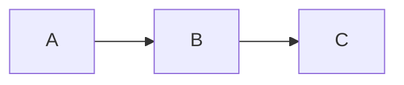
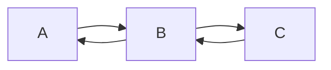

# Linked Lists

Each node has a value and pointer. In this case the nodes have their respective A, B, C values and point to the next node in sequence.
# Double Linked Lists

Each node has a value as well as a next and previous pointer.

These are considered dynamic data structures because the size of it is really easy to change. Simply add a new node or remove a node by adjusting the previous pointers. 